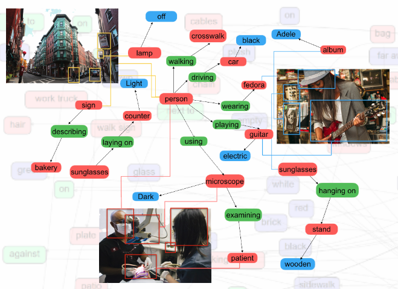

# visual_genome2AOG

## transform visual genome data to And Or Graph

visual genome数据集：https://visualgenome.org/

数据集的涉及内容：

108,077 Images

5.4 Million Region Descriptions

1.7 Million Visual Question Answers

3.8 Million Object Instances

2.8 Million Attributes

2.3 Million Relationships

Everything Mapped to Wordnet Synsets

结构化的数据内容：

数据集主要包括七个主要部分：

- region descriptions
- objects
- attributes
- relationships
- region graphs
- scene graphs
- question answer pairs



在该程序中，我们主要使用了scene graphs部分。该部分的数据结构为：

```
[...
{
"image_id": 2407890,
"objects": [...
{
"object_id": 1023838,
"x": 324,
"y": 320,
"w": 142,
"h": 255,
"name": "cat",
"attribute": "red"
"synsets": ["cat.n.01"]
},
{
"object_id": 5071,
"x": 359,
"y": 362,
"w": 72,
"h": 81,
"name": "table",
"synsets": ["table.n.01"]
},
...],
"relationships": [...
{
"relationship_id": 15947,
"predicate": "wears",
"synsets": ["wear.v.01"],
"subject_id": 1023838,
"object_id": 5071,
}
...]
},
...]
```

主要包括objects部分和relationships部分，其中objects里还包含了attribute。

**该程序的主要目的是将该数据集转化为AOG的格式。**关于AOG的定义如下：
$$
G_{\text {and }-\text { or }}=<S, V_{N}, V_{T}, \mathcal{R}, \mathcal{P}>
$$

​	其中，$S$是根节点（root），表示一个场景或者目标物体；

​	$V_{N}=V^{\text {and }} \cup V^{\text {or }}$表示非终端节点；

​	$V_{T}$属于终端节点（对于低分辨率的object不可直接分解）；

​	$R$是节点间的大量关系；

​	$P$则是AOG的概率模型。

​	Configuration：
$$
\mathcal{C}=\langle V, E\rangle
$$
​	从根节点root产生的配置是语法的语言：$G_{\text {and }-\text { or }}$：
$$
\mathbf{L}\left(G_{\text {and }-\text { or }}\right)=\Sigma=\left\{\mathcal{C}_{k}: S \stackrel{G_{\text {and }-\text { or }}}{\Longrightarrow} \mathcal{C}_{k}, k=1,2, \ldots, N\right\}
$$
​	每个配置$\mathcal{C} \in \Sigma$，对应于场景中各物体之间的关系。

因此需要根据visual genome数据集求每个或节点的概率。

该程序针对室内场景，选取了bedroom，living，kitchen，office，bathroom，dining，conference七个场景分类的图像，分别统计每类图像中object、attribute、relationships的概率。其中

- object的概率为每类图像中出现的次数/该类图像的总数
- attribute的概率为每种object包含该属性的次数/该object的数目
- relationships的概率为每种object与其他object之间的关系/该object的数目

由于不考虑动态因素，因此去除了人、房间、墙等物体。最终生成的数据结构为：

```
{
    "kitchen": {
        "relationships": {
            "microwave": {
                "counter": {
                    "sum": 0.18673218673218672,
                    "ON": 0.18673218673218672
                },
                ...
        },
        "objects": {
            "faucet": 0.19292989814260036,
            ...
        },
        "attribute": {
            "person": {
                "standing": 0.1043956043956044
            },
            ...
        }
    },
    ...
}
```


